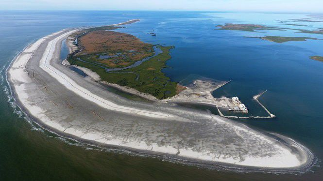

Located offshore, barrier islands are dynamic landforms that are formed from offshore bars and, spits. Barrier islands undergo continuous migration through a process of erosion and accretion.[^1] [^2] Given the migratory process through which they derive their structure, hard approaches to coastal protection tend to disrupt the formation of barrier islands. Barrier islands have been protected for decades in some areas, e.g., Miami. However, impending SLR could lead to the abandonment of barrier islands as a retreat strategy.[^2] Barrier islands can be both inhabited or uninhabited. They evolve over time with coastal processes, to form several unique ecosystems, including subaerial beaches, dune fields, interior wetlands, and back-barrier bays or wetlands. These ecosystems provide habitat for a wide range of plants and marine species.

_Whiskey Island, Louisiana_

## Types of barrier islands

- **Bay barriers** enclose a pond, marsh, or other marine ecosystems that are connected by two headlands. They are sometimes referred to as bay mount bar or bay bar.
- **Tombolos** are sand and gravel beaches that connect one or more offshore islands or that connect one or more islands to the mainland. They are sometimes referred to as connecting bars, tie bars, and tying bars.
- **Barrier spits** are barriers that extend into open water and that are attached to a mainland at only one end. Where they extend across a bay or other coastal habitat, barrier spits develop to form bay barriers. Where an inlet is created, a bay barrier can develop into a barrier spit.
- **Dunes or beach barriers** are created when winds that protect landward aquatic habitats form wide sand barrier beaches with hills and ridges.[^10]

## Benefits

- Provides important support for marine and terrestrial habitats
- Helps to maintain salinity gradients which contribute to supporting a sustainable coastal wetland ecosystem[^12]
- Shelters estuaries and protects aquatic ecosystems that exist between the barrier and a mainland.
- Offers storm surge protection through wave attenuation. For example, barrier beaches that front embaymemts absorb wave energy[^10]

## Challenges

- Barriers erode naturally over time due to longshore redistribution of sediments[^11]
- Large volumes of sand are required to renourish eroding barriers
- Barriers develop from unconsolidated sediments and are therefore highly unstable and unsuitable for built development
- Erosion of barriers leads to changes in sheltered wetlands including changes in salinity, tidal range, and sediment load[^11]
- Preservation becomes increasingly difficult where there exist high levels of shoreline and bathymetric changes[^11]

### Blue Dunes
#### NJ and NY, USA

The Blue Dunes Project is a proposal for a series of offshore barrier islands along the New Jersey and New York harbor.[^2] The proposal investigates how design can be integrated into the future of coastal protection strategies. The project requires coordination between multiple stakeholders (scientists, engineers, planners, economists, and maritime stakeholders) to address key issues such as water quality, habitat protection, recreation, navigation, construction, and funding.[^3] Led by the design team WXY/West 8, the design of the barrier island considers both the large scale coastal protection and the potential of offshore renewable energy to address the future of coastal life, economy, and property.[^4]

### Mississippi Coastal Improvements Program
#### MS, USA

The Mississippi Coastal Improvements Program is a large-scale barrier island restoration project intended to restore and protect the Gulf Islands National Seashore barrier islands.[^5] The project began in 2007 with the assistance of the US Army Corps of Engineers (USACE) and other agencies. The project focuses on the re-nourishment of several islands and the restoration of natural sediment transport.[^6] The dredging and nourishment cost is estimated to be approximately \$368 million and requires about 14.5 million cubic meters of sediment.[^7] Ongoing monitoring by the National Park Service keeps track of the success of the project focusing on sand accretion, restoration of natural transport processes, and protection of cultural resources.[^8]

<!-- Regular citations -->

[^1]:
  “Barrier Island.” Wikipedia, Wikimedia Foundation, 2 July 2019, https://en.wikipedia.org/wiki/Barrier_island.
[^2]:
  https://www.weforum.org/agenda/2018/09/barrier-islands-protect-coastlines-but-they-are-also-vulnerable/
[^3]:
  “Blue Dunes– The Future of Coastal Protection.” Rebuild by Design, http://www.rebuildbydesign.org/our-work/all-proposals/finalist/blue-dunes--the-future-of-coastal-protection.
[^4]:
  Ibid.
[^5]:
  Ibid.
[^6]:
  Schupp, Courtney A., et al. Coastal Adaptation Strategies: Case Studies 2015. pp. 35. https://home.nps.gov/subjects/climatechange/upload/2015-11-25-FINAL-CAS-Case-Studies-LoRes.pdf.https://www.nps.gov/subjects/climatechange/upload/2015-11-25-FINAL-CAS-Case-Studies-LoRes.pdf
[^7]:
  Ibid, 35.
[^8]:
  Ibid, 35.
[^9]:
  Ibid, 35.
[^10]:
  US Fish and Wildlife Service. (2018). What are Coastal Barrier Landforms? https://www.fws.gov/cbra/Coastal-Barriers.html
[^11]:
  USGS. Science for a changing world. Coastal and Marine Geology program. Louisiana Barrier Islands: A Vanishing Resource, https://pubs.usgs.gov/fs/barrier-islands/
[^12]:
  Knotts, C. P., Grandy, G. M., & Khalil, S. M. (2007). RESTORATION OF LOUISIANA'S BARRIER ISLANDS–EVALUATION AND ANALYSIS. In Coastal Engineering 2006: (In 5 Volumes) (pp. 1977-1988). 1

<!-- Images -->

[^i1]:
  GEOLOGY AND GEOGRAPHY OF THE NEW YORK BIGHT geo.hunter.cuny.edu
[^i2]:
  WYX/West 8. Blue Dunes Rendering. http://www.rebuildbydesign.org/data/images/724/ap-10-6-13-1-.png.
[^i3]:
  NPS. Barrier Islands Provide Protection for Wildlife, Plants, and Humans. https://www.nps.gov/guis/learn/nature/images/WildernessLandingPage.jpg?maxwidth=1200&autorotate=false.
[^i4]:
  Figure 1. Baurick, T. (2020). Building barriers: Inside the race to save Louisiana's first line of storm defense. https://www.nola.com/news/environment/article_df61c669-14cc-5ba7-821d-2ee7c57becd9.html
