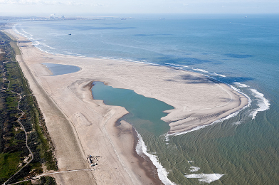
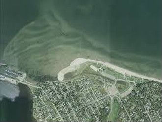

Beach nourishment (beach renourishment, beach replenishment, or sand replenishment) involves a process of replacing material (usually sand) to a beach that might have been lost by longshore drift or erosion.[^1] Beach sediment is usually sourced from off-shore dredging and pumped onto the beach area where it is dispersed naturally or mechanically. This increases beach elevation and width. Beach nourishment helps to dissipate wave energy: the wider the beach, the more energy is dissipated.[^2] Artificial beach nourishment is a long-term maintenance effort. The volume and frequency of fill used will change over time based on the impacts of drivers such as sea-level rise, and other erosive effects along a shoreline. Long-term artificial beach nourishment requires on-going monitoring, funding, and maintenance programs to be successful.[^2]

## Types of beach nourishment

- Backshore nourishment involves the strengthening of the backshore at the foot of a dune to reinforce the upper portion of a beach. This is done to strengthen the dune against erosion and breaches during an extreme event. Materials are built up at the front of the dune as a buffer. However, this material may be eroded during an extreme event.[^11] [^12]
- Shoreface nourishment is generally used in coastal areas where protection measures have resulted in the steepening of the profile of the shoreline leading to long-term sediment deficit. It involves building up the shoreface, i.e., “the area between the mean low water mark and the fair-weather wave base.'' This leads to the reduction of waves which enhances the accumulation of beach material.[^11] [^12]
- Veneer fill involves placing beach-quality sands over material that is generally unsuitable for beach nourishment. The unsuitable materials (grossly coarser or finer than normal beach sand), forms the sublayer beneath a thin surface sand veneer.[^13]
- Beach and surf zones are created by depositing sand high up the beach. The sand deposits are protected using revetments, groynes, detached breakwaters, and submerged sills.

## Benefits

- Reduces the negative impacts of coastal erosion
- Serves as an adaptive measure against sediment erosion
- Allows for integration with hard solutions, e.g., sea walls
- Provides or restores habitat and supports recreational tourism 
- Can help to complement other grey protection strategies, e.g., seawalls or groynes, and green strategies such as dune reinforcement. Beach nourishment can also be improved by contracting dunes that can function as sand reservoirs.
- Is relatively inexpensive and adaptable to changing conditions. Where the beach profile changes the beach can be renourished.
- Materials extracted for other purposes can be utilized for beach nourishment, e.g., material extraction for dredging. 

## Challenges

- Often has unintended (negative) impacts on flora and fauna that occupy the intertidal areas and beaches
- May lead to the introduction of new sediment with different microorganisms
- Requires large volumes of sand (and related challenges with supply)
- Requires ongoing renourishment and financial resources[^13]

### Sand Engine 
#### The Hague, Netherlands

The Sand Engine (or Sand Motor) is a unique beach nourishment experiment in using coastal processes (wind, waves, currents) to replenish a section of the Dutch coast over time. This project seeks to prevent flooding by building with nature. During construction, 21.5 million cubic meters of sand dredged 10 kilometers off the coast, was used to create a hook-shaped peninsula.[^3] Coastal geomorphological processes have since moved significant amounts of the sediment both to the north and south of the Sand Engine.[^4] This process has created 3,500 acres of new beach and dune. Ongoing monitoring and data collection contribute to tracking geomorphological processes in response to storms and currents. This data will be used to predict behavior, and to determine if sand engines can be used elsewhere. In addition to beach nourishment, the Sand Engine is creating new habitat for flora and fauna, as well as recreational areas for visitors. 

### Parlee Beach Nourishment Program 
#### Pointe-Du-Chene NB, Canada

The beach nourishment program at Parlee Beach is part of an ongoing management program that uses a portion of the park entrance fee as funding for beach nourishment.[^5] In addition to mitigating the impacts of storms, the beach nourishment, and associated maintenance and management aims to promote vegetative growth to stabilize dunes. In this way, beach nourishment provides a habitat for marine animals as well as a recreation area for visitors. The volume of sand that is added to the beach varies from year to year. The amount of nourishment required is determined by an annual assessment. The assessment determines the amount of sand lost from storm damage from the previous year.[^6] As is the case with most beach nourishment programs; the source and match of beach sediment is a challenge. However, with the Parlee Beach Nourishment Program, the material is obtained through land-based processes from sand collected north of the beach.[^7] Because the harvested sand shares the same characteristics as the local beach sand, it functions similarly and retains the same aesthetics.

<!-- Regular citations -->

[^1]
  Beach nourishment, https://www.ctc-n.org/technologies/beach-nourishment
[^2]
  The Arlington Group Planning Architecture Inc., et al. Sea Level Rise Adaptation Primer. pp. 77. https://www2.gov.bc.ca/assets/gov/environment/climate-change/adaptation/resources/slr-primer.pdf.
[^3]
  Sand Engine http://nlintheusa.com/sand-engine/
[^4]
  Ibid, 77.
[^5]
  Parlee Beach Provincial Park Best Management Practices, https://www.welcomenb.ca/content/dam/gnb/Departments/eco-bce/Promo/Parlee_Beach/pdfs/10_parlee_beach_provincial_park_bmp_July_19_2017-e.pdf
[^6]
  “Introduction.” The Sand Engine, https://www.dezandmotor.nl/en/the-sand-motor/introduction/
[^7]
  Ibid.
[^8]
  The Arlington Group Planning Architecture Inc., et al. Sea Level Rise Adaptation Primer. pp. 77 https://www2.gov.bc.ca/assets/gov/environment/climate-change/adaptation/resources/slr-primer.pdf.
[^9]
  Parlee Beach Provincial Park. pp. 9. https://www2.gnb.ca/content/dam/gnb/Departments/eco-bce/Promo/Parlee_Beach/pdfs/10_parlee_beach_provincial_park_bmp_July_19_2017-e.pdf.
[^10]
  Ibid, 9.
[^11]
  Climate Adapt. Beach and shoreface nourishment (2015). https://climate-adapt.eea.europa.eu/metadata/adaptation-options/beach-and-shoreface-nourishment 
[^12]
  Citation: Mangor, Karsten (2020): Shore nourishment. Available from http://www.coastalwiki.org/wiki/Shore_nourishment [accessed on 8-10-2020] 
[^13]
  Finkl C.W., Walker H.J. (2005) Beach Nourishment. In: Schwartz M.L. (eds) Encyclopedia of Coastal Science. Encyclopedia of Earth Science Series. Springer, Dordrecht. https://doi.org/10.1007/1-4020-3880-1_35

<!-- Images -->

[^i1]:
  GEOLOGY AND GEOGRAPHY OF THE NEW YORK BIGHT geo.hunter.cuny.edu
[^i2]:
  WYX/West 8. Blue Dunes Rendering. http://www.rebuildbydesign.org/data/images/724/ap-10-6-13-1-.png.
[^i3]:
  NPS. Barrier Islands Provide Protection for Wildlife, Plants, and Humans. https://www.nps.gov/guis/learn/nature/images/WildernessLandingPage.jpg?maxwidth=1200&autorotate=false.
[^i4]:
  Figure 1. Baurick, T. (2020). Building barriers: Inside the race to save Louisiana's first line of storm defense. https://www.nola.com/news/environment/article_df61c669-14cc-5ba7-821d-2ee7c57becd9.html
